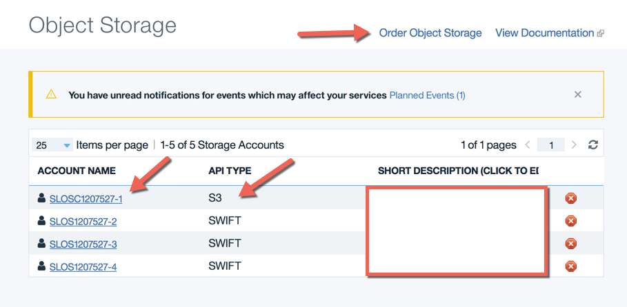
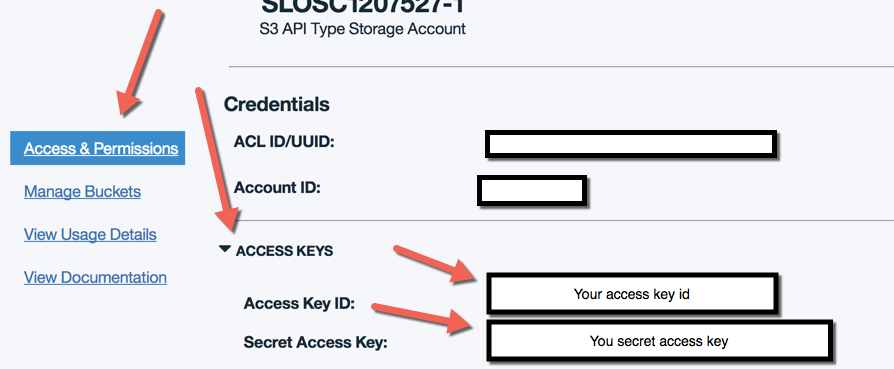
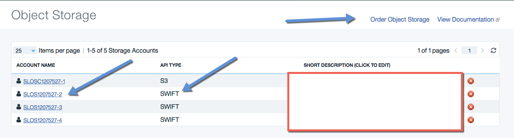
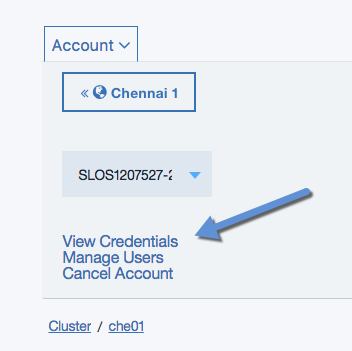
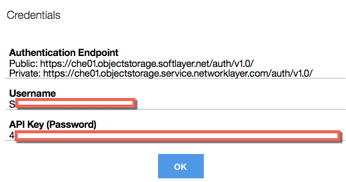

# Finding your IBM Cloud ObjectStorage access credentials
Don't know how to find your access credentials for IBM Cloud ObjectStorage (COS) S3 or Swift?

## IBM Cloud Object Storage (S3) API
The IBM Cloud ObjectStorage S3 API uses a combination of an Access Key ID and a Secret Access Key to interact with your buckets. You will need these keys to manage your buckets and objects.
You can find this information on the [Softlayer Customer Portal][sl] under the [Object Storage][slos] section. Select the Account name to get the details of the storage account. If you don't have an existing account with the API Type of S3, click the Order Object Storage link in the upper right corner.

Once you are on the details page of your COS S3 account, select the "Access & Permissions" link and expand the "Access Keys" section. Your Access Key ID and Secret Access Key will now be visible.

## IBM Cloud Object Storage (Swift) API
Check out the [Access the Object Storage Screen][swift-access] for the official docs. My version is as below.

The IBM Cloud ObjectStorage Swift API use a combination of a Username and an API Key for accessing Swift storage. You will need these keys to manage your containers and objects.
You can find this information on the [Softlayer Customer Portal][sl] under the [Object Storage][slos] section. Select the Account name. If you don't have an existing account with the API Type of Swift, click the Order Object Storage link in the upper right corner.

You will then need to select the data center where your data is or will be located. One Swift account can be available in any or all of the data centers listed. The same credentials can be used in any of the locations, but containers and objects are only available in the data centers you use (i.e. no automatic replication).

Once you select the details page of your COS Swift account, select the "View Credentials" link.

 A dialog box will be shown with the public and private endpoints along with your Username and API Key.

[swift-access]: https://knowledgelayer.softlayer.com/procedure/access-object-storage-screen
